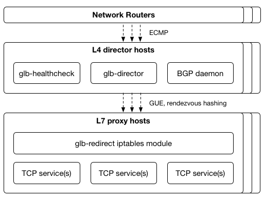
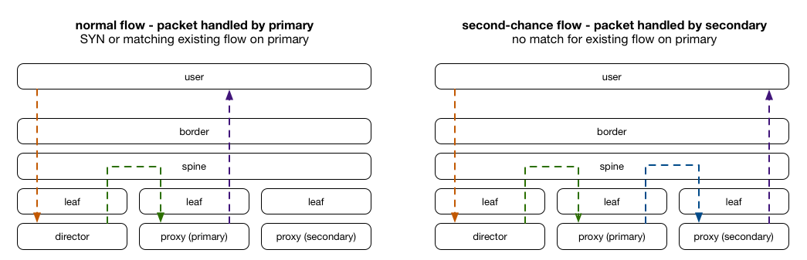

# GitHub Load Balancer Director

The GitHub Load Balancer (GLB) Director is a set of components that provide a scalable set of stateless [Layer 4](https://en.wikipedia.org/wiki/Transport_layer) load balancer servers capable of line rate packet processing in bare metal datacenter environments, and is used in production to serve all traffic from GitHub's datacenters.

## Design

GLB Director is designed to be used in datacenter environments where multiple servers can announce the same IP address via BGP and have network routers shard traffic amongst those servers using [ECMP routing](https://en.wikipedia.org/wiki/Equal-cost_multi-path_routing). While ECMP shards connections per-flow using consistent hashing, addition or removal of nodes will generally cause some disruption to traffic as state isn't stored for each flow. A split L4/L7 design is typically used to allow the L4 servers to redistribute these flows back to a consistent server in a flow-aware manner. GLB Director implements the L4 (director) tier of a split L4/L7 load balancer design.

Traditional solutions such as [LVS](https://en.wikipedia.org/wiki/Linux_Virtual_Server) have stored flow state on each director node and then shared flow state between nodes. GLB Director instead receives these flows and uses a [derivative of rendezvous hashing](./docs/development/glb-hashing.md) to hash flows to a pair of servers with a pre-determined order, and [leverages the state already stored](./docs/development/second-chance-design.md) on those servers to allow flows to complete after a server begins draining.

GLB Director only processes packets on ingress, and encapsulates them inside an [extended Generic UDP Encapsulation](./docs/development/gue-header.md) packet. Egress packets from proxy layer servers are sent directly to clients using Direct Server Return.

## Getting started

GLB Director has a number of components that work together with other infrastructure components to create a complete load balancer. We've created an [example Vagrant setup/guide](./docs/setup/example-setup-vagrant.md) which will create a local instance of GLB with all required components. The [docs](./docs/) directory also contains additional documentation on the design and constraints. For details about the packages provided and how to install them, see the [packages and quick start guide](./docs/setup/packages-quick-start.md).

## Contributing

Please check out our [contributing guidelines](CONTRIBUTING.md).

## License

Components in this repository are licensed under BSD 3-Clause except where required to be GPL v2 depending on their dependencies and usage, see the [license documentation](./LICENSE.md) for detailed information.

## Authors

GLB Director has been an ongoing project designed, authored, reviewed and supported by various members of GitHub's Production Engineering organisation, including:

- [@joewilliams](https://github.com/joewilliams)
- [@nautalice](https://github.com/nautalice)
- [@ross](https://github.com/ross)
- [@theojulienne](https://github.com/theojulienne)
