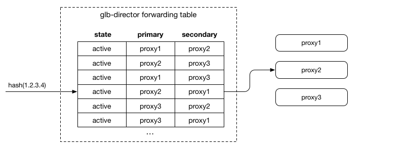
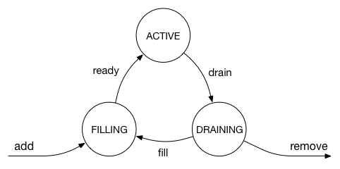
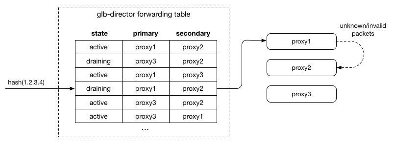
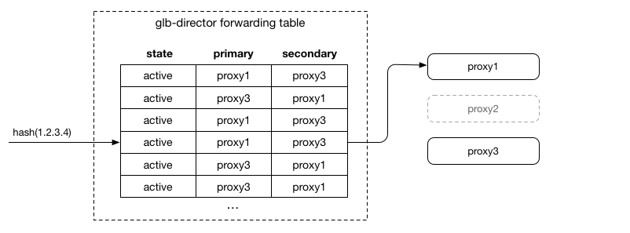
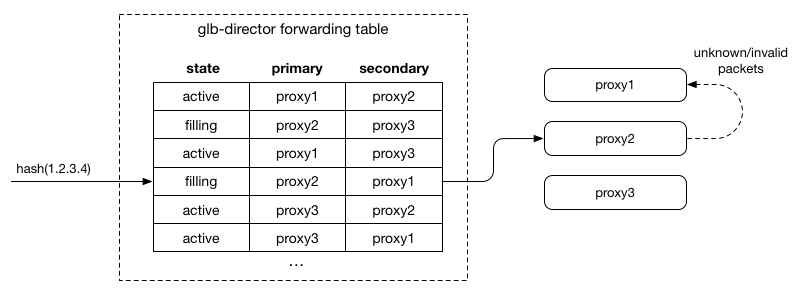

# GLB Director Hashing: Generating the GLB Forwarding Table 

GLB Director uses a variant of rendezvous hashing to create a static forwarding table to map incoming flows to a given pair of proxy servers, designated the "primary" and "secondary".

Incoming packets are hashed on their source IP using siphash, using a shared secure key. The hash is used as an index into the director forwarding table (current of size `2^16`) which determines the proxy host(s) that will receive the packets. The packet is encapsulated inside another [GUE tunnel](./gue-header.md) packet (along with the IP of the secondary inside the GUE header), and forwarded to the primary proxy host.

The hash table is sized appropriately so that for each primary proxy node, there is a roughly even distribution of entries for each other secondary node, meaning that when a host drains, no one secondary receives all its traffic. Since we have 2^16 as the hash table size, at around 2^8 proxy hosts we would start to see biases as not all proxy hosts would have an entry as secondary for any other given primary proxy host. It seems reasonable that 256 proxy hosts for a single external IP+port combination would be enough for most use cases (though the table size can trivially be extended if this limit is reached). If these are assigned randomly, they will approximate even spread during draining.

We use rendezvous hashing and utilise the feature of decent hash functions to convert input values into pseudo-random numbers. To generate the proxy servers for a given row of the forwarding table, we take a `siphash` of a seed for the row (generated as `row_seed = siphash(row_index, table_seed)`) and the IP of each proxy server, then sort the proxy servers using that value. This generates a pseudo-random order for the proxy servers, maintaining the invariant that any 2 proxy servers in a given row will always have the same relative order, regardless of the other proxy servers in the row.

## Making changes to proxies

In GLB's design, adding or removing proxy servers require some care. This is because a forwarding table entry only defines a primary/secondary proxy, so the draining/failover only works with at most 1 proxy host in draining. We define the following valid states and state transitions for a proxy server:

When a proxy server is `active`, `draining` or `filling`, it is included in the forwarding table entries. In a stable state, all proxy servers are `active`, and the rendezvous hashing described above will have an approximately even and random distribution of each proxy server in both the `primary` and `secondary` columns.

As a proxy server transitions to `draining`, we adjust the entries in the forwarding table by swapping the `primary` and `secondary` entries we would have otherwise included:

This has the effect of sending packets to the server that was previously `secondary` first. Since it receives the packets first, it will accept SYN packets and therefore take any new connections. For any packet it doesn't understand as relating to a local flow, it forwards it to the other server (the previous `primary`), which allows existing connections to complete.

This has the effect of draining the desired server of connections gracefully, after which point it can be removed completely, and proxies can shuffle in to fill the empty `secondary` slots:

A node in `filling` looks just like `active`, since the table inherently allows a second chance:

This implementation requires that no more than one proxy server at a time is in any state other than `active`, which in practise has worked well at GitHub. The state changes to proxy servers can happen as quickly as the longest connection duration that needs to be maintained.

## Health checking & proxy failover

Keen observers will note that we kept a secondary node around, even when the servers are all `active`. The `glb-healthcheck` component utilises this to work around single proxy-server failures by detecting a tunnel or HTTP failure, and regenerating the forwarding table with the failed node as `secondary` in any entry where it would otherwise by `primary`.

Each director does this independently. This is a sort of temporary best-effort draining of a node, and won't break connections even if directors disagree on health state providing all proxies are `active`.

## Future: Relaxing the 2-server row size

In practise, we've found the limitation of a primary+secondary a reasonable compromise given the quantity of servers in a given forwarding table is fairly small. There are plans to relax these requirements in future versions by allowing the table to contain more than a fixed set of 2 proxies per row, and to allow bias in selecting the secondary server outside a failure domain of the primary (the proxy-side `glb-redirect` module and header format already [support multiple proxy hops](./gue-header.md)).
