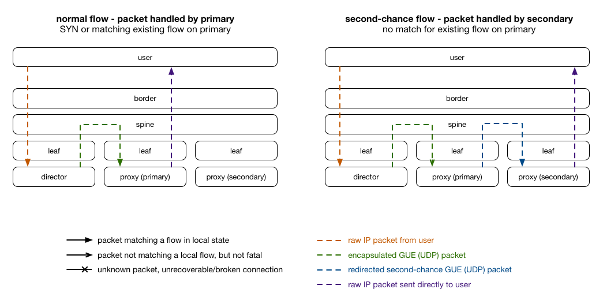
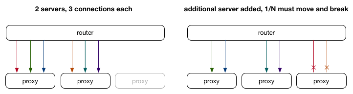
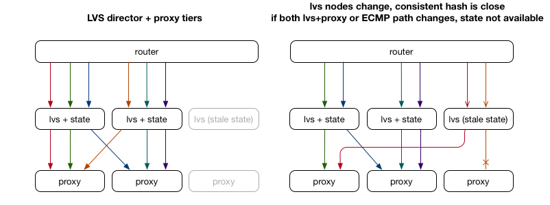
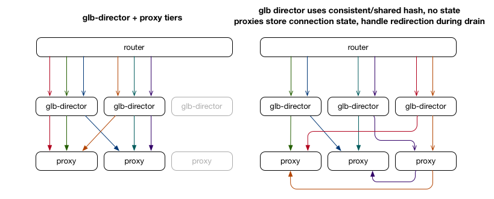

# "Second Chance" packet flows: a comparison

GLB Director uses an implementation of rendezvous hashing to allow connections to complete when servers are added or removed, while not requiring state to be stored on the director servers themselves, or shared between any servers. Instead, the state already available on the destination server in the Linux kernel's TCP stack is used. This document outlines the packet flow used by GLB, and a comparison to other technologies traditionally serving a similar purpose.

## Overview of packet flow

The director holds a forwarding table for each service, which includes a lookup to map an incoming flow hash to a pre-computed primary and secondary pair created by a [variant of rendezvous hashing](./glb-hashing.md). The primary is the server that should respond to connections under normal circumstances. If the primary doesn't understand the packet because it's not a TCP SYN packet or a packet that corresponds to an already established local flow, the `glb-redirect` iptables module will forward the packet to the secondary server listed in the forwarding table entry (which `glb-director` includes in the [tunnel header](./gue-header.md)).

## Comparison to ECMP

To start, it's worth reviewing the cases where ECMP, or other consistent hashing with no stored flow state, are unable to protect against connection termination when the set of servers backing an IP address changes.

The image on the left shows a simplified scenario where 2 proxy servers are receiving flows from 6 sources, hashed equally amongst those servers using ECMP (or similar). Since the packet headers are used to hash flows (typically src/dst ip/port), as long as the set of servers doesn't change, existing TCP connections will continue to be hashed to the same proxy server until they terminate gracefully.

On the right, we can see that in a situation where we add a new server while those connections are still in progress, 1/3 of all connections, including those original connections, must be rebalanced. In order to ensure that connections are hashed equally, it must start hashing packets in a way that balances packets across servers equally. However, if the router doesn't hold per-flow state for the flows that have been seen so far and which server they mapped to, it must by design break certain flows by redirecting them to the new server. In the worst case, more connections may rehash (to maintain an equal balance) or be unbalanced (to reduce rehasing).

## Comparison to LVS and other director-state solutions

The traditional solution to this problem involves adding a "director" tier in between the routers and proxy servers, which use either flow state or a more customised hashing mechanism (or both) to improve connection stability during server changes. Each connection that passes through the director tier is stored in a lookup table so that subsequent packets are directed to the same server, even if the set of proxies change. [LVS](https://en.wikipedia.org/wiki/Linux_Virtual_Server) is often used to implement this, using a consistent hashing function to approximate the same backend proxy selection across director hosts even when the packet changes director hosts as well.

There are still cases where flows can fall through the cracks when network paths change and servers are added or removed. To solve this, LVS director servers typically use [multicast UDP state syncing](http://kb.linuxvirtualserver.org/wiki/LVS_Cluster_Management#Cluster_Monitoring), where as new flows are seen the state is replicated to other director servers so this is less likely. However, the director nodes in this design require cross-communication and also need to store duplicate connection state which is already available on the proxy nodes, and there is still some latency on those flows being kept in sync.

At GitHub, we typically have very long lived connections (git push/clone) and so wish to store as little additional/duplicate state as possible, and also minimise inadvertant disruption as much as possible since it's not as convenient to simply retry requests.

## GLB Director: using the existing flow state on the proxies

GLB takes a different approach, by using the flow state already stored in the proxy servers as part of maintaining established Linux TCP connections from clients. When a packet arrives on the primary server and isn't valid, it is sent to the secondary server. The [variant of rendezvous hashing](./glb-hashing.md) used to get the primary/secondary server is done once, up front, and so doesn't need to be recalculated on a per-flow basis. When a new proxy server is added, in certain forwarding table entries it becomes the new primary, and the old primary becomes the secondary. This allows existing flows to complete, because the proxy server can make the decisions with its local state, the single source of truth.

Importantly, the GLB director tier is completely stateless in terms of TCP flows: they can come and go at any time, and will always pick the same primary/secondary server providing their forwarding tables match (but they rarely change). To change proxies, some care needs to be taken, as described in [GLB hashing](./glb-hashing.md).
