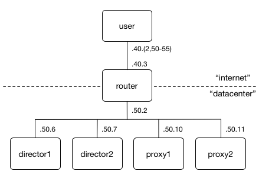

# Example Setup with Vagrant

This repository contains a complete Vagrant example of GLB Director and supporting components. While some aspects of this are hard-coded, it should still provide some insight into how a running GLB instance runs and allow observations of the packet flow including encapsulation and tunneling.

The Vagrant setup has the following VMs configured, to emulate a datacenter network on one side of a router (in the real world, routers), with user(s) on the other side accessing a GLB-enabled IP:



The `director` machines announce the `10.10.10.10` VIP to the `router` via BGP using BIRD. The router then propegates that route to the `user` machine using BGP as well. For return path, the proxies have a static route to the user subnet via the router (in a normal datacenter environment, this would usually be the handled by the default route).

## Bringing up the Vagrant machines

To get it up and running, the CI script in this repo will build all packages and install them in Vagrant VMs, then run some tests:
```
script/cibuild
```

Once this completes, you should be able to log in to the nodes using `vagrant ssh` to view each component's running state.

## Accessing the example VIP through GLB

The `10.10.10.10` VIP is running `nginx` on port 80, and each proxy server returns its hostname, making it easy to see the L4 load balancing taking effect. The `user` machine has a handfull of IPs set up to make it easy to change the source IP and thus the proxy server you're hashed to:
```
vagrant ssh user -- curl --silent http://10.10.10.10 --interface 192.168.40.2
vagrant ssh user -- curl --silent http://10.10.10.10 --interface 192.168.40.50
vagrant ssh user -- curl --silent http://10.10.10.10 --interface 192.168.40.51
vagrant ssh user -- curl --silent http://10.10.10.10 --interface 192.168.40.52
vagrant ssh user -- curl --silent http://10.10.10.10 --interface 192.168.40.53
vagrant ssh user -- curl --silent http://10.10.10.10 --interface 192.168.40.54
vagrant ssh user -- curl --silent http://10.10.10.10 --interface 192.168.40.55
```

## Monitoring the tunnel traffic on proxies

Each Vagrant machine has wireshark dissectors installed for the GLB GUE packet format. The following command will display the inner and outer IP addresses as well as the contained TCP messages:
```
tshark -i any -T fields -e ip -e tcp udp port 19523
```

For example, the SYN packets for some of the above requests will demonstrate both that the directors are sharding traffic using ECMP, and that they are sharding traffic to proxies using GLB hashing. The distribution to `director` nodes will change based on Linux's choice of routing, while the mapping from source IP to `proxy` server will always be consistent as per [GLB hashing design](../development/glb-hashing.md).
```
# director2 -> proxy1 when accessing from 192.168.40.50
Internet Protocol Version 4, Src: 192.168.50.7, Dst: 192.168.50.10,Internet Protocol Version 4, Src: 192.168.40.50, Dst: 10.10.10.10	Transmission Control Protocol, Src Port: 37877, Dst Port: 80, Seq: 0, Len: 0

# director1 -> proxy2 when accessing from 192.168.40.51
Internet Protocol Version 4, Src: 192.168.50.6, Dst: 192.168.50.11,Internet Protocol Version 4, Src: 192.168.40.51, Dst: 10.10.10.10	Transmission Control Protocol, Src Port: 39497, Dst Port: 80, Seq: 0, Len: 0

# director1 -> proxy1 when accessing from 192.168.40.52
Internet Protocol Version 4, Src: 192.168.50.6, Dst: 192.168.50.10,Internet Protocol Version 4, Src: 192.168.40.52, Dst: 10.10.10.10	Transmission Control Protocol, Src Port: 57479, Dst Port: 80, Seq: 0, Len: 0

# director2 -> proxy2 when accessing from 192.168.40.54
Internet Protocol Version 4, Src: 192.168.50.7, Dst: 192.168.50.11,Internet Protocol Version 4, Src: 192.168.40.54, Dst: 10.10.10.10	Transmission Control Protocol, Src Port: 55133, Dst Port: 80, Seq: 0, Len: 0
```

## Making changes to the setup

The files under `/etc/glb` on each director configure the GLB director itself as well as the health check daemon. Specifically of interest:
 * `/etc/glb/forwarding_table.src.json` - The configuration for the GLB forwarding table. This must be the same across all director servers servicing the same VIPs. If you change this file, signal the healthchecker to reload it using `systemctl reload glb-healthcheck`.
 * `/etc/glb/forwarding_table.checked.json` - The `glb-healthcheck` daemon will update this file whenever it is reloaded or health state changes for a proxy.
 * `/etc/glb/forwarding_table.checked.bin` - The `glb-healthcheck` daemon will call out to `glb-director-cli` to convert the `.json` version to this binary version that the director will load.
 * `/etc/glb/healthcheck.conf` - Configures the healthchecker, and notably includes the `.bin` file generation and signalling of `glb-director` to reload.
 * `/etc/glb/director.conf` - Configures the director itself.

To simulate host changes (draining, filling, etc), update `forwarding_table.src.json` on both director machines and then run `systemctl reload glb-healthcheck`.
