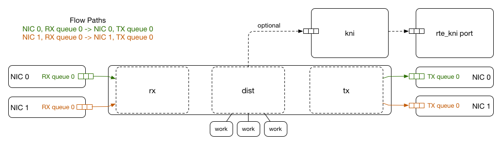

# glb-director configuration

The `glb-director` component is the main DPDK application that processes inbound packets and encapsulates them using GUE to server(s) designated by the GLB hasing algorithm. 

There are 2 places the director can be configured:
 * `/etc/default/glb-director` - Configuration around the DPDK EAL runtime and other similar configuration options, used by systemd.
 * `/etc/glb/director.conf` - The default location for the configuration of how the director processes packets on CPU cores and on ports/NICs.

## `/etc/default/glb-director`

`GLB_DIRECTOR_CONFIG_FILE` specifies the config file to use, by default `/etc/glb/director.conf`.

`GLB_DIRECTOR_FORWARDING_TABLE` specifies the binary forwarding table to use. By default, the package references a non-healthchecked file, which should manually be updated, `/etc/glb/forwarding_table.bin`. To enable the `glb-healthcheck` service to work with the director, this will typically be changed to `/etc/glb/forwarding_table.checked.bin`.

`GLB_DIRECTOR_EAL_ARGS` specifies the options to be provided to the [DPDK Environment Abstraction Layer](https://doc.dpdk.org/guides/prog_guide/env_abstraction_layer.html) at startup. Typically this is where you would configure which CPU cores (`lcore` by DPDK definition) will be made available to DPDK, and which NICs (`ports` by DPDK definition) will be provided. There are many other options that may be useful depending on the environment.

GLB Director requires that at least 3 cores are provided. The first (master lcore) just does house-keeping operations like loading forwarding tables and processing signals, while all other cores are used to perform actions (described below). Review the DPDK documentation for details on best practises here, however we typically advise using the Linux kernel `isolcpus` option to prevent Linux from scheduling work on DPDK cores. On CPUs that support hyperthreads, we only run DPDK on one of the hyperthreads and leave the other empty (both hyperthreads would be included in `isolcpus` in this case where hyperthreads are still left enabled on other cores for Linux processes - alternatively, hyperthreading could be disabled entirely).

## `/etc/glb/director.conf`

### `outbound_gateway_mac`

_required_

GLB Director doesn't handle ARP requests or responses for simplicity, since Linux is already expected to be providing a full TCP/IP stack on the same NIC. Instead, this option should be configured to be the MAC of the router or top of rack switch that the director host is connected to. GLB will use this as the destination MAC in every forwarded packet.

### `outbound_src_ip`

_required_

Similarly, this specifies the source IP to use for outbound forwarded packets. Typically, this will be the same IP as the machine itself, and Linux will usually be responding to all requests on that IP.

### `forward_icmp_ping_responses`

_optional_

By default, GLB Director will forward ICMP pings to one of the backends. If this isn't desired, it can be disabled.

### `num_worker_queues`

_required_

The number of NIC RX/TX queues to configure on each NIC that is bound to DPDK. This must not be larger than the maximum number supported by your NIC. Note that since GLB Director/DPDK processes packets extremely fast and can spread work amongst cores, this can typically be as low as `1` to support 10G NIC line rate.

### `rx_drop_en`

_optional_

By default, GLB Director will tell the NIC to drop packets when no RX descriptors are available. In certain DPDK drivers (like the E1000 used in Vagrant), this isn't supported, and so may be disabled.

### `flow_paths`

_required_

GLB Director processes packets from a NIC RX queue, encapsulates them, and drops them on a NIC TX queue. A flow path configures a mapping from inbound to outbound queue, such as:
```
{ "rx_port": 0, "rx_queue": 0, "tx_port": 0, "tx_queue": 0 }
```

Generally, and in the default configuration, packets from NIC/Port 0 RX queue 0 are processed and written out to NIC/Port 0 TX queue 0. However, if you have multiple NICs, multiple queues, or want to receive and transmit packets across ports/queues, one or more flow paths can be constructed to do this.

In a typical bonded NIC environment, this might be configured as:
```
{ "rx_port": 0, "rx_queue": 0, "tx_port": 0, "tx_queue": 0 },
{ "rx_port": 1, "rx_queue": 0, "tx_port": 1, "tx_queue": 0 }
```

The above bonded NIC configuration is reflected in this diagram:


### `lcores`

_required_

In `GLB_DIRECTOR_EAL_ARGS` above, DPDK provided GLB Director with a set of lcores. In this section, they are configured to perform specific tasks.

The `master lcore` should not be listed here and defaults to performing housekeeping work.

Each other core should be configured as one of 2 potential modes. Keys in this setting are `lcore-N` where `N` is the DPDK lcore number.

#### Distributor

```
    "lcore-1": {
      "rx": true,
      "tx": true,
      "flow_paths": [0],

      "dist": true,
      "num_dist_workers": 1,

      "kni": true
    },
```

A distributor lcore performs at minimum `rx` work (receiving from a NIC queue), `dist` work (distributing packets to workers), and `tx` work (pushing to a NIC queue). Currently all three of these must be enabled on the same lcore (though this may change in the future).

`flow_paths` specifies a list of the indexes into the previously defined set of `flow_paths`. A single distributor can process packets for multiple flows (e.g. on the bonded setup above, this may be configured as `[0,1]`).

`num_dist_workers` specifies how many worker cores will reference this distributor core.

`kni` is an optional extension that uses DPDK's [Kernel NIC Interface](https://doc.dpdk.org/guides/prog_guide/kernel_nic_interface.html) to enable passthrough of non-forwarded packets to Linux. If this is enabled, a new `vglb_kniN` interface will be created for each NIC provided to DPDK, and any packets that don't match forwarding table binds will arrive on that interface. Packets sent to the interface will be sent out the NIC transparently. This allows a configuration where DPDK owns the entire NIC, but services like BGP can be run on Linux over the `vglb_kniN` interfaces. If using [DPDK Flow Bifurcation](https://doc.dpdk.org/guides/howto/flow_bifurcation.html), this can be disabled, since only relevant packets are ever sent to DPDK.

#### Worker

```
    "lcore-2": {
      "work": true,
      "work_source": 1
    }
```

Worker lcores take packets received by the distributor, hash them, encapsulate them, then send them back to the distributor to be sent to the NIC. For more details of the technical implementation of this and why it's used, see [DPDK Packet Distributor Library](https://doc.dpdk.org/guides/prog_guide/packet_distrib_lib.html).

`work_source` configures the lcore index of the distributor core that work will be sourced from. The number of cores that reference any given distributor should match that distributor core's `num_dist_workers`.
